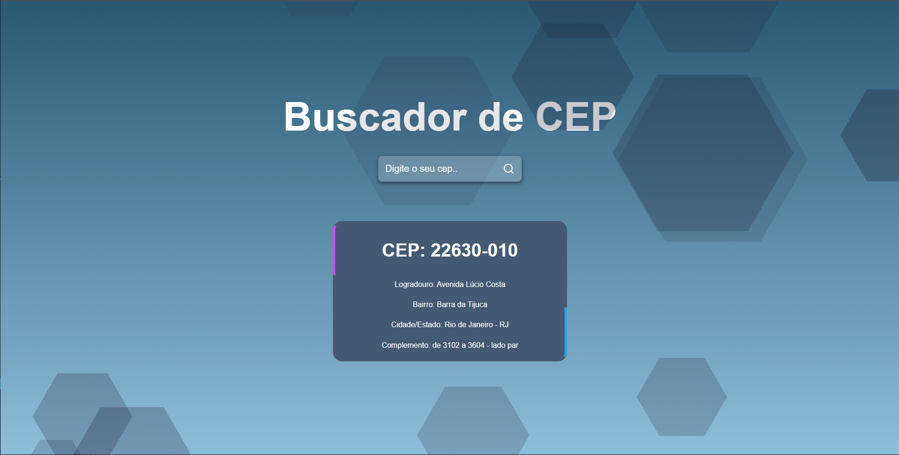

# Buscador de CEP

Sistema feito com React, onde o intuito é apenas de aprendizado.

## Objetivo do Sistema

O sistema busca o CEP que o usuário digitou e retorna algumas informações do mesmo, como:

* Logradouro

* Complemento

* Bairro

* Cidade/Estado

  

### Segue imagens do funcionamento do sistema

